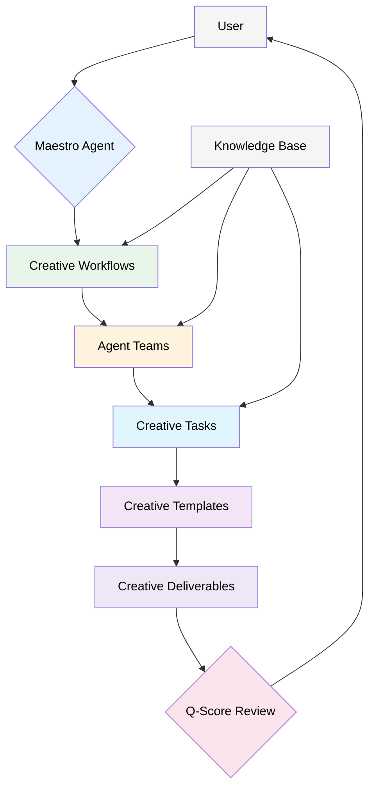

# BMAD Creative Method - Core Architecture

This document outlines the core architecture of the BMAD Creative Method, a comprehensive framework for managing and executing creative projects.

## System Overview

The BMAD Creative Method is a modular, agent-based system designed to guide creative projects from initial concept to final delivery. It is built on a foundation of best-in-class creative methodologies and is designed to be flexible and adaptable to any creative challenge.

## Key Components

### 1. Maestro Agent
The entry point to the system. The Maestro agent is responsible for:
-   **Guided Onboarding:** Engaging the user in a dialogue to understand their project needs.
-   **Workflow Recommendation:** Recommending the optimal creative workflow based on the user's inputs.
-   **Team Assembly:** Assembling the correct team of specialized AI agents for the project.

### 2. Creative Workflows
A series of YAML files that define the step-by-step process for a specific type of creative project. Each workflow is composed of stages, and each stage contains a series of tasks. We have core workflows for:
-   **Blue Sky Creative:** For brand new projects.
-   **Brand Evolution:** For working with existing brands.

### 3. Agent Teams
A collection of specialized AI agents that are assembled to execute a creative workflow. Each agent has a specific role and set of responsibilities, mirroring the structure of a world-class creative agency.

### 4. Creative Tasks
The individual units of work within a workflow. Each task is a markdown file that defines a specific action to be taken by an agent, such as `create-creative-brief.md` or `mood-board-creation.md`.

### 5. Creative Templates
A library of YAML and markdown files that provide the structure for key creative documents, such as the `creative-brief-tmpl.yaml` or the `style-guide-tmpl.yaml`.

### 6. Q-Score Framework
A standardized quality assurance framework, defined in the `quality-rubric-tmpl.yaml`. This allows for consistent and objective evaluation of creative work.

### 7. Knowledge Base
A central repository of creative principles, best practices, and user preferences that informs the behavior of the entire system.

## Extensibility

The BMAD Creative Method is designed to be extensible. New agents, workflows, tasks, and templates can be added to the `bmad-core` to expand the capabilities of the system. Additionally, the system is designed to support "expansion packs" for highly specialized creative disciplines (e.g., `bmad-game-design-pack`).
